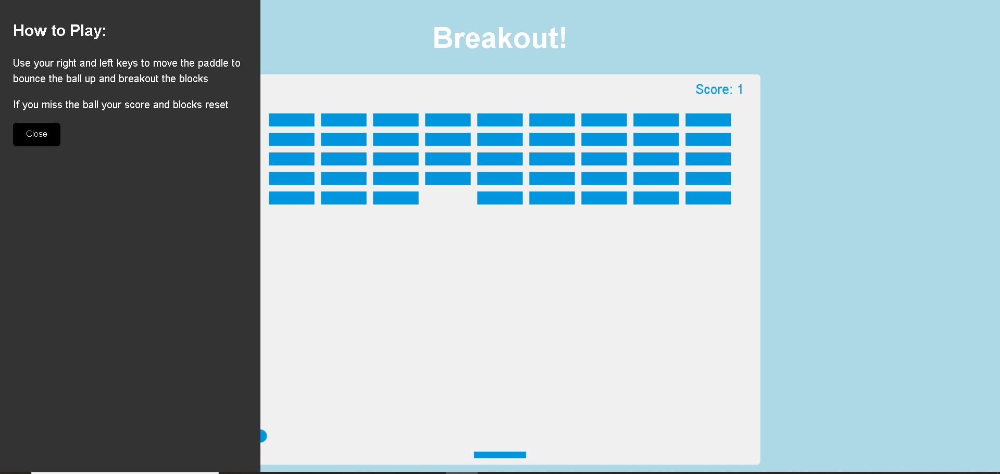

# Brick Breaker Game

This is a simple **Brick Breaker** game built using **HTML5 Canvas** and **JavaScript**. The objective of the game is to break all the bricks on the screen by controlling a paddle to bounce a ball. As you break bricks, your score increases. If you lose the ball, the game will reset, but the bricks will be restored.

---

## Features

- **Ball movement**: The ball bounces off walls, the paddle, and breaks bricks.
- **Paddle control**: Move the paddle left or right to control the ball's direction.
- **Bricks**: A grid of bricks appears at the top of the screen. Every brick can be broken by the ball.
- **Score**: Your score increases as you break bricks.
- **Reset game**: When all bricks are cleared or the ball falls off the screen, the game resets the bricks and the score.
- **Responsive interface**: The game is interactive and can be played using the keyboard arrow keys.

---

## Installation

1. Clone or download the repository.
   https://github.com/Chand-007/BreakoutGameCanvasAPI.git
2. Open the index.html file in your browser to start playing the game.

---

## Screenshot

